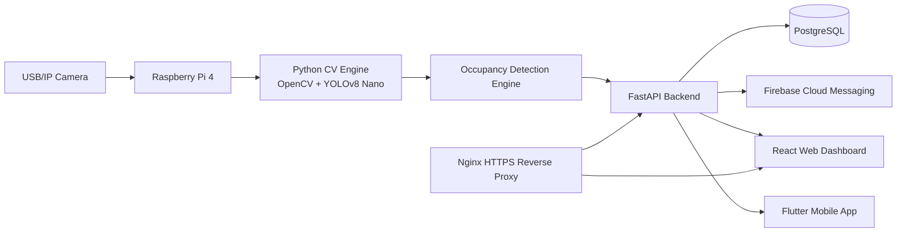

# Smart Seat Occupancy Monitoring and Analytics System

A production-ready starter project for monitoring office seats, cabins, workstations, and chairs with Computer Vision and IoT.

The system uses a Raspberry Pi camera node to detect whether a person is inside a configured seat region, sends only occupancy events to a FastAPI backend, stores events and analytics in PostgreSQL, and exposes web and mobile dashboards.

## Architecture



## What is stored

This project intentionally stores occupancy events and analytics only:

- seat occupied start time
- seat empty end time
- duration in seconds
- daily/weekly/monthly/yearly analytics
- notification records

It does **not** store full video recordings.

## Repository layout

```text
.
├── backend/                 # FastAPI + SQLAlchemy API service
├── cv_engine/               # Raspberry Pi Python OpenCV/YOLO occupancy engine
├── database/                # PostgreSQL SQL schema and ER diagram
├── docs/                    # Beginner guides for every phase
├── flutter_app/             # Flutter + Riverpod + Dio mobile app
├── infra/                   # Docker Compose, Nginx, deployment assets
└── web_dashboard/           # React + TypeScript + Material UI dashboard
```

## Quick start with Docker

1. Copy environment files:

```bash
cp backend/.env.example backend/.env
cp cv_engine/.env.example cv_engine/.env
```

2. Start the platform:

```bash
docker compose -f infra/docker-compose.yml up --build
```

3. Open:

- Backend API docs: http://localhost:8000/docs
- Web dashboard: http://localhost:5173
- PostgreSQL: localhost:5432

Default local admin seed is not automatic. Register a user through `POST /register` or the web login/register flow.

## Phases

Each phase has source code, commands, configuration, testing steps, expected output, and common fixes:

1. [Computer Vision Module](docs/phase-1-computer-vision.md)
2. [Raspberry Pi Integration](docs/phase-2-raspberry-pi.md)
3. [Backend Development](docs/phase-3-backend.md)
4. [Database Integration](docs/phase-4-database.md)
5. [Web Dashboard](docs/phase-5-web-dashboard.md)
6. [Flutter App](docs/phase-6-flutter-app.md)
7. [Notifications](docs/phase-7-notifications.md)
8. [Docker Deployment](docs/phase-8-docker-deployment.md)

## Core APIs

Authentication:

- `POST /register`
- `POST /login`

Camera management:

- `GET /cameras`
- `POST /camera`
- `PUT /camera/{camera_id}`
- `DELETE /camera/{camera_id}`

Seat management:

- `GET /seats`
- `POST /seat`

Occupancy and analytics:

- `GET /occupancy`
- `POST /occupancy/events`
- `GET /occupancy/daily`
- `GET /occupancy/weekly`
- `GET /occupancy/monthly`
- `GET /analytics/dashboard`

See [API examples](docs/api-examples.md).

## Security features

- JWT authentication
- Bcrypt password hashing
- Role-based access control
- Pydantic validation
- CORS allowlist configuration
- Nginx HTTPS-ready reverse proxy
- No video retention by default

## Hardware

Recommended hardware:

| Item | Purpose |
| --- | --- |
| Raspberry Pi 4 Model B, 4GB+ | Edge inference node |
| USB Camera or RTSP/IP Camera | Seat/cabin video feed |
| 5V 3A USB-C power supply | Stable Pi power |
| 32GB+ Class 10 microSD card | Raspberry Pi OS and app |
| Ethernet or Wi-Fi | Backend connectivity |
| Camera mount/tripod | Stable fixed view |
| Optional heat sink/fan | Long-running inference stability |

Full beginner setup: [Hardware and Raspberry Pi setup](docs/hardware-and-pi-setup.md).

## Occupancy formula

```text
Occupancy Percentage = Occupied Time / 24 Hours x 100
```

For work-hour analytics the backend also supports custom date ranges and can be extended to use office-hour denominators.

## Development notes

- `cv_engine` sends only state transition events to the backend.
- The backend computes durations when an occupied interval closes.
- Dashboard analytics are queried from PostgreSQL using SQLAlchemy.
- Firebase Cloud Messaging is optional locally and enabled when credentials are configured.
