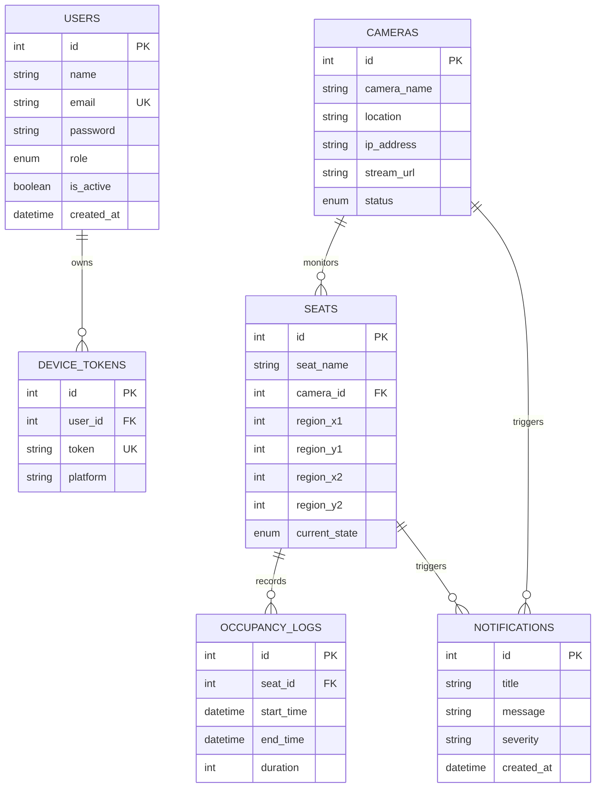

# ER Diagram

```mermaid
erDiagram
    USERS ||--o{ DEVICE_TOKENS : owns
    CAMERAS ||--o{ SEATS : monitors
    SEATS ||--o{ OCCUPANCY_LOGS : records
    CAMERAS ||--o{ NOTIFICATIONS : triggers
    SEATS ||--o{ NOTIFICATIONS : triggers

    USERS {
      int id PK
      string name
      string email UK
      string password
      enum role
      boolean is_active
      datetime created_at
    }
    CAMERAS {
      int id PK
      string camera_name
      string location
      string ip_address
      string stream_url
      enum status
    }
    SEATS {
      int id PK
      string seat_name
      int camera_id FK
      int region_x1
      int region_y1
      int region_x2
      int region_y2
      enum current_state
    }
    OCCUPANCY_LOGS {
      int id PK
      int seat_id FK
      datetime start_time
      datetime end_time
      int duration
    }
    NOTIFICATIONS {
      int id PK
      string title
      string message
      string severity
      datetime created_at
    }
    DEVICE_TOKENS {
      int id PK
      int user_id FK
      string token UK
      string platform
    }
```
